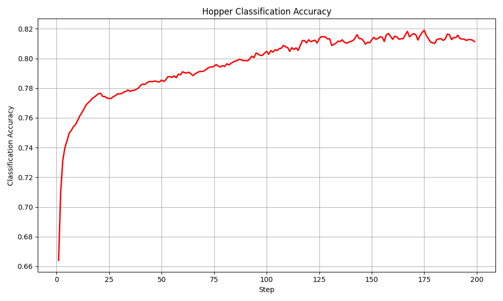
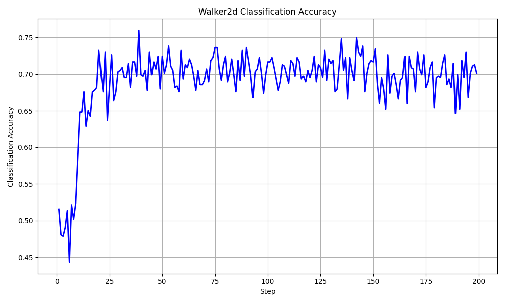
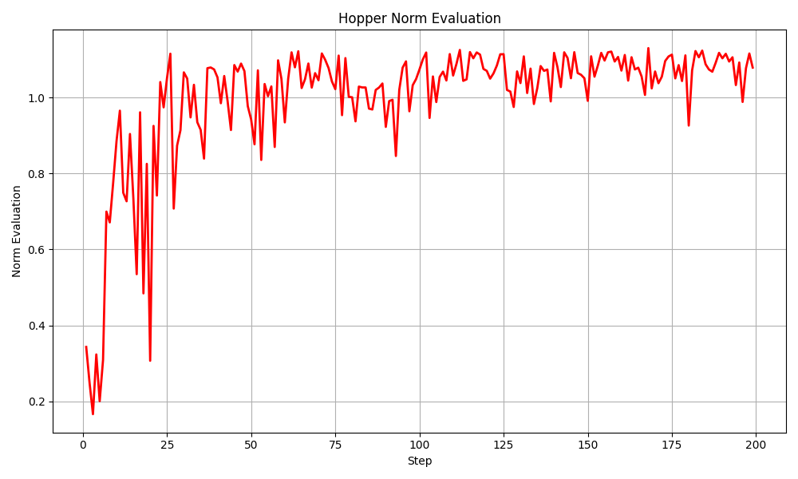
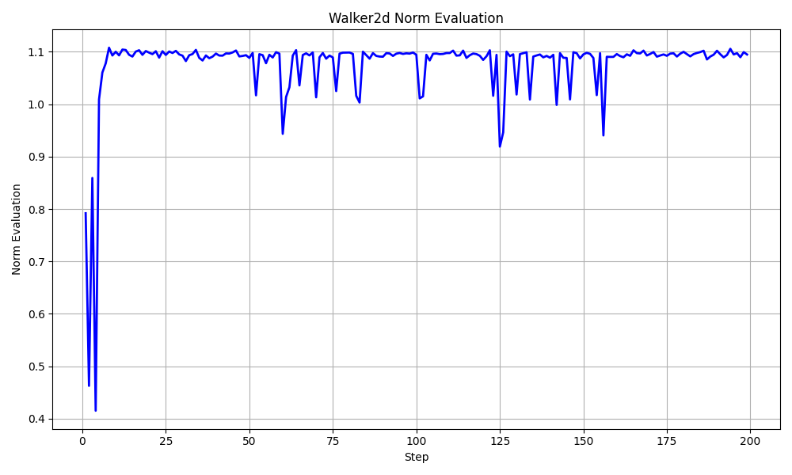
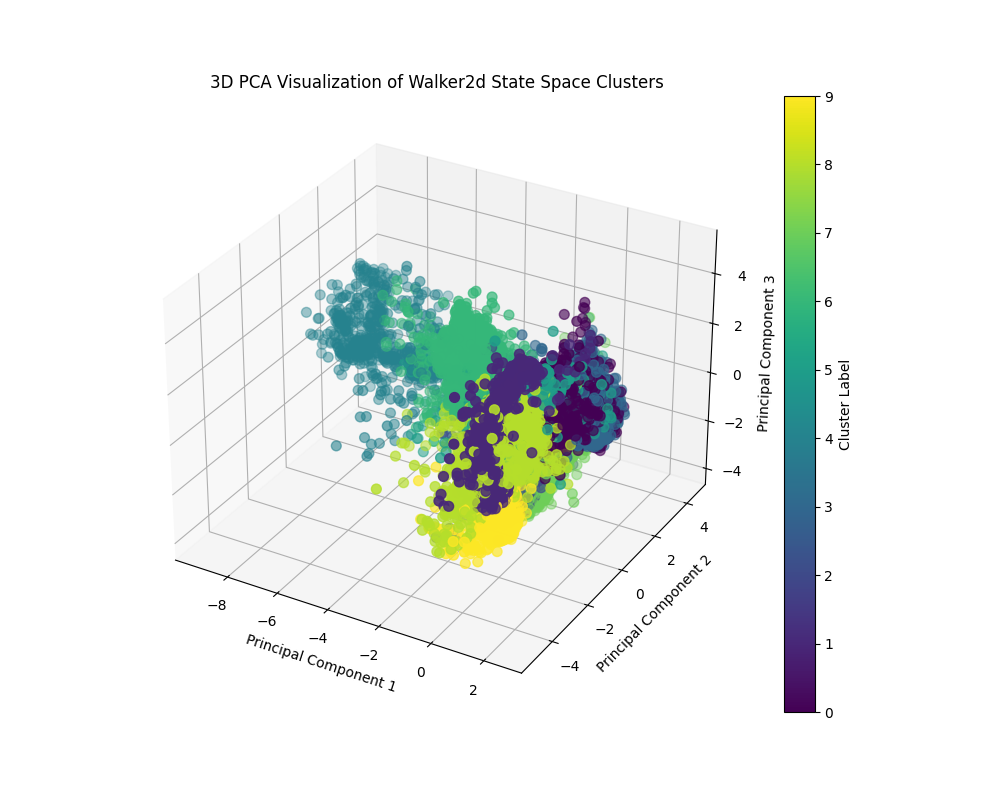

# Diffusion Q-Learning with Clustering-Driven Data Stratification

A side-project extension of Diffusion-QL for robust offline RL on imbalanced datasets, featuring Q-value thresholding and k-means clustering of the state space.

---

## Overview

This repository explores how to improve diffusion-based Q-learning (Diffusion-QL) when training on **skewed offline datasets** (e.g., 25% expert data + 75% medium data). We:

1. **Extended** Diffusion-QL with a simple **Q-value thresholding** classifier (85% accuracy) to isolate high-quality transitions.
2. **Generalized** to a **k-means clustering** scheme over the state space—creating “buckets” that improve data stratification and classification.
3. **Demonstrated** near–SOTA performance on D4RL benchmarks (Hopper & Walker2d) despite heavy class imbalance.
4. **Visualized** the 3D PCA projection of Walker2d states to show effective clustering.

---

## Key Results

### Classification Accuracy (75–80%)

  


Our k-means driven stratification yields **75–80%** accuracy in identifying expert-level transitions.

---

### Policy Evaluation (Normalized Returns)

  


Even with only **25% expert data**, our method matches standard Diffusion-QL returns on both Hopper and Walker2d benchmarks.

---

### State-Space Clustering Visualization



3D PCA projection of Walker2d shows clear cluster separation—enabling effective k-means stratification.

---

## Method

1. **Data Stratification**  
   - **Q-Thresholding (Prototype):** Label transitions as “high-quality” if critic Q-value > threshold.  
   - **k-Means Clustering:** Project states via PCA, cluster into **k** groups, and treat each cluster as a quality “bucket.”

2. **Sampling Scheme**  
   - Prioritize batches by cluster-derived quality buckets.  
   - Blend clusters over training to gradually incorporate medium-quality data.

3. **Training Loop**  
   ```bash
   python train.py \
     --env hopper-medium-skill-v2 \
     --clustering kmeans \
     --n_clusters 5 \
     --expert_ratio 0.25 \
     --steps 500_000
